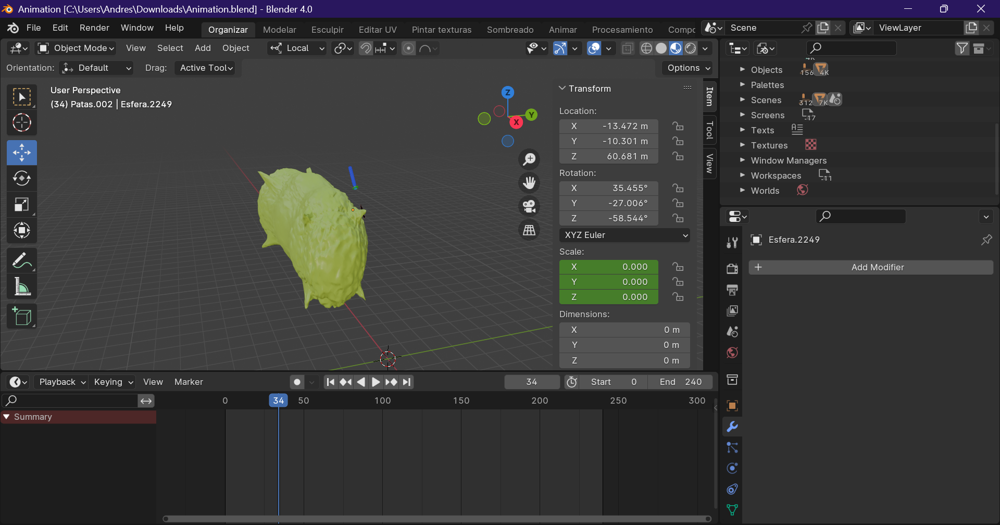

# 🧬 Visualización Interactiva del Bacteriófago M13

Este proyecto presenta una **simulación interactiva en 3D** del proceso de replicación del bacteriófago M13, diseñado con **Blender** y visualizado mediante **Three.js** en una aplicación web. Su objetivo principal es apoyar la enseñanza y divulgación científica del ciclo replicativo de este virus bacteriano.



---

## 🎯 Objetivo

El objetivo de este repositorio es documentar el proceso de desarrollo y visualización de la animación 3D del bacteriófago M13, sin compartir directamente los modelos 3D para descarga. En su lugar, se explican las herramientas utilizadas, la estructura del proyecto y se ofrecen recursos para que otros puedan replicar o adaptar esta visualización.

---

## 🛠️ Tecnologías utilizadas

- [Blender](https://www.blender.org/) – Modelado y animación 3D
- [Three.js](https://threejs.org/) – Visualización interactiva en el navegador
- [React](https://reactjs.org/) + [@react-three/fiber](https://github.com/pmndrs/react-three-fiber) – Framework para renderizar la escena en web
- [JavaScript / HTML / CSS] – Tecnologías de base para desarrollo web

---

## 📁 Estructura del repositorio

```
/bacteriofago-m13-visualizacion
├── README.md
├── LICENSE
├── /docs
│   ├── introduccion.md
│   ├── guia-implementacion.md
│   ├── arquitectura.md
│   └── referencias.md
├── /assets
│   └── imagenes-referenciales/
├── /src
│   └── ejemplo-codigo/
```

- `README.md`: Introducción general al repositorio.
- `/docs`: Documentación detallada del proyecto.
- `/assets/imagenes-referenciales`: Capturas de pantalla del proceso en Blender.
- `/src/ejemplo-codigo`: Fragmentos de código para replicar el flujo.

---

## 🚀 Cómo empezar

Este repositorio **no contiene los modelos 3D originales** por razones de protección de derechos, pero sí incluye:

- Capturas referenciales del modelado y animación en Blender
- Descripción detallada del flujo de trabajo
- Fragmentos de código para visualizar modelos en Three.js
- Recomendaciones para alojar y proteger tu animación en la web

Revisa la [guía de implementación](./docs/guia-implementacion.md) para conocer los pasos completos.

---

## 🧑‍🎓 Público objetivo

Este proyecto está dirigido a:

- Estudiantes de ciencias y tecnología
- Investigadores en microbiología o bioinformática
- Desarrolladores interesados en visualización científica
- Profesores que deseen utilizar modelos 3D en educación

---

## 📜 Licencia

Este repositorio se encuentra bajo la licencia [MIT](./LICENSE), lo cual permite su reutilización con fines académicos, siempre y cuando se dé el debido crédito.

---

## ✍️ Autor

**Jonathan Oviedo**  
Estudiante de Software  
Proyecto de tesis – DESARROLLO DE UNA APLICACIÓN WEB 3D PARA LA SIMULACIÓN Y VISUALIZACIÓN DE LA INTERACCIÓN ENTRE EL BACTERIÓFAGO M13 Y SU ENTORNO  
Escuela Superior Politécnica de Chimborazo
