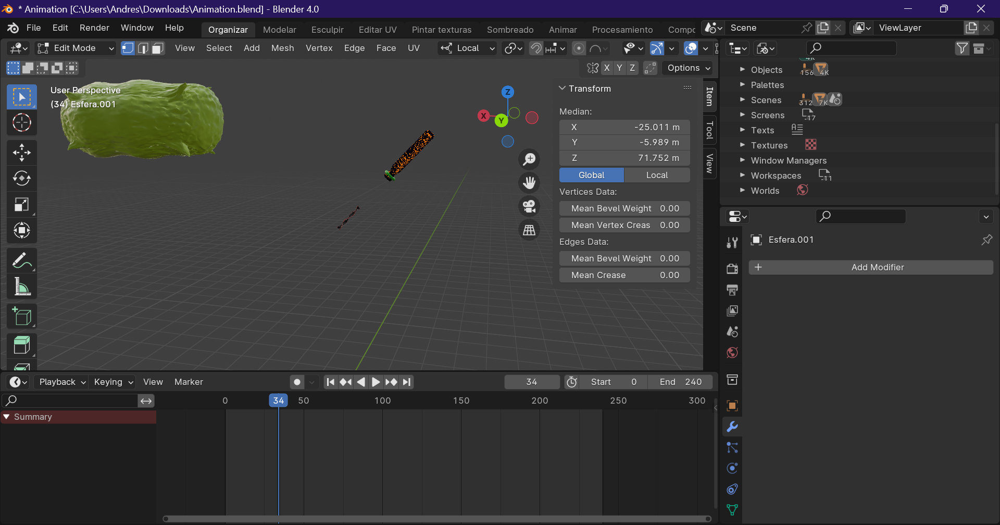

# Introducción

El bacteriófago M13 es un virus que infecta bacterias, en particular aquellas que poseen pilis sexuales tipo F, como *Escherichia coli*. Su ciclo replicativo es atípico, ya que no destruye a la célula huésped al liberar nuevas partículas virales, lo que lo convierte en un modelo importante para el estudio de procesos de replicación, ensamblaje y liberación viral.

Este proyecto tiene como objetivo representar de forma **interactiva y visual** el proceso de replicación del bacteriófago M13 mediante el uso de tecnologías 3D accesibles. A través del modelado con **Blender** y la integración en una plataforma web con **Three.js y React**, se busca facilitar la comprensión de su ciclo replicativo tanto a estudiantes como docentes e investigadores.

---

## ¿Por qué el M13?

El fago M13 ha sido ampliamente estudiado en biotecnología y biología molecular debido a su capacidad para ser modificado genéticamente. Se utiliza en investigaciones que van desde la nanotecnología hasta la creación de bibliotecas de ADN. Su pequeño tamaño y ciclo no lítico lo hacen ideal para fines académicos y experimentales.

---

## Importancia de la visualización 3D

Visualizar en tres dimensiones permite a los usuarios:

- Comprender mejor la interacción del virus con la bacteria
- Identificar las etapas del proceso de replicación
- Interactuar con el modelo en tiempo real (rotación, zoom, navegación)
- Utilizar la herramienta con fines educativos y de divulgación

La visualización 3D representa un puente entre el conocimiento teórico y la comprensión práctica, transformando información compleja en una experiencia accesible y dinámica.

---

## Escena de referencia

*Figura: Modelo 3D del bacteriófago M13 creado en Blender.*

---
